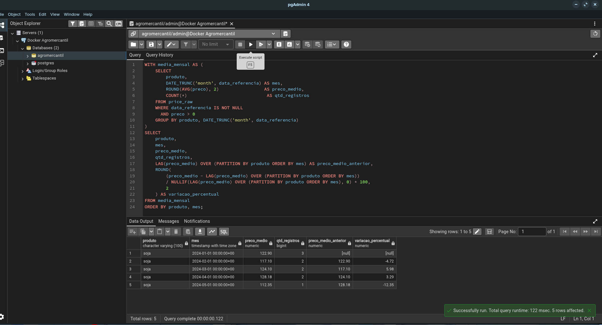
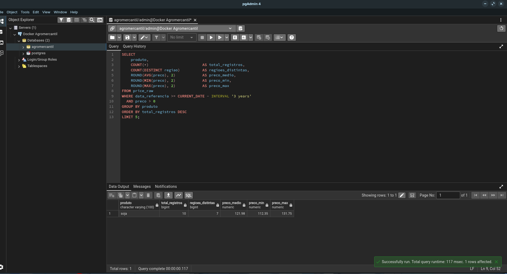
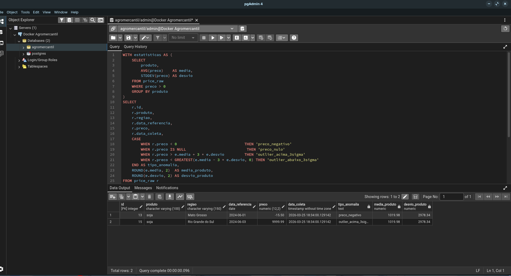
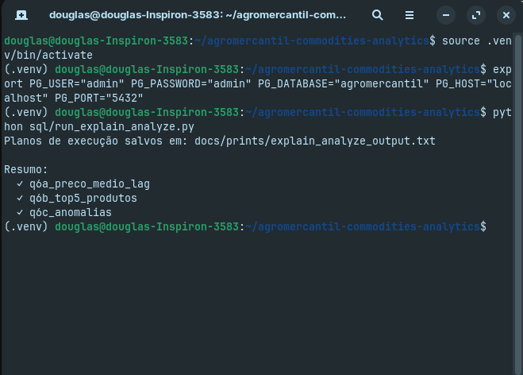
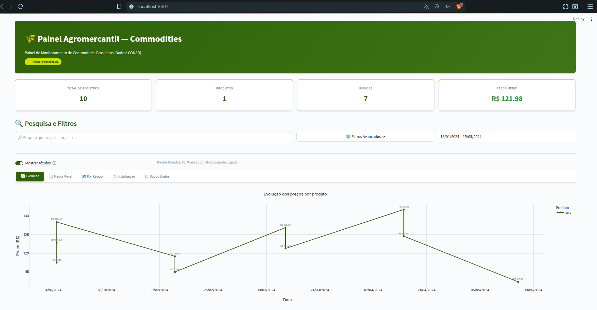

# Agromercantil — Commodities Analytics

> Avaliação técnica: Analista de Dados (Webscraping) — pipeline completo de coleta, ETL, análise SQL e visualização de preços de commodities agrícolas brasileiras.

## Sobre o projeto

Pipeline end-to-end de dados de commodities agrícolas brasileiras (soja, milho, café), com coleta automatizada via webscraping da CONAB, armazenamento em PostgreSQL com arquitetura de Data Lake em três camadas, análises SQL e dashboard interativo em Streamlit.

**Fonte de dados:** [CONAB — Companhia Nacional de Abastecimento](https://www.conab.gov.br/info-agro/analises-do-mercado-agropecuario-e-extrativismo-florestal)

## Stack

| Camada | Tecnologia |
|--------|-----------|
| Webscraping | Python 3.11, requests, BeautifulSoup4 |
| Armazenamento local | CSV, JSON, Parquet |
| Banco de dados | PostgreSQL 16 |
| ETL | Python, pandas, psycopg2 |
| Análise | pandas, matplotlib |
| Visualização | Streamlit, Plotly |
| Testes | pytest |

## Estrutura do projeto

```
agromercantil-commodities-analytics/
├── data/
│   ├── raw/          # Dados brutos da CONAB
│   ├── processed/    # Dados tratados pelo ETL
│   └── curated/      # Dados prontos para análise
├── scraper/          # Webscraping
├── etl/              # Transformação e carga
├── sql/              # DDL, queries e índices
├── analysis/         # EDA com pandas e matplotlib
├── app/              # Dashboard Streamlit
├── tests/            # Testes (pytest)
└── docs/prints/      # Screenshots
```

## Como executar

### 1. Pré-requisitos

```bash
git clone https://github.com/douglasmagalhaess1/agromercantil-commodities-analytics
cd agromercantil-commodities-analytics
python -m venv .venv
source .venv/bin/activate
pip install -r requirements.txt
```

### 2. Variáveis de ambiente

```bash
cp .env.example .env
# Edite .env com suas credenciais do PostgreSQL
```

### 3. Banco de dados

```bash
# Com Docker:
docker run -d --name agro-pg \
  -e POSTGRES_USER=postgres \
  -e POSTGRES_PASSWORD=postgres \
  -e POSTGRES_DB=agromercantil \
  -p 5432:5432 \
  postgres:16-alpine

# Criar tabelas e índices:
psql -h localhost -U postgres -d agromercantil -f sql/schema/01_create_tables.sql
psql -h localhost -U postgres -d agromercantil -f sql/schema/02_indexes.sql
```

> Se já possui PostgreSQL instalado, ajuste as credenciais no `.env` e ignore o Docker.

### 4. Scraper

```bash
python -m scraper.conab_scraper
```

### 5. ETL

```bash
python -m etl.transform
python -m etl.load
```

### 6. Análise exploratória

```bash
python analysis/eda.py
```

### 7. Dashboard

```bash
streamlit run app/streamlit_app.py
```

### 8. Testes

```bash
pytest tests/ -v
```

## Dificuldades encontradas

O scraping da CONAB apresentou obstáculos reais que exigiram tratamento específico no código:

**Encoding ISO-8859-1:** parte dos relatórios legados da CONAB é servida com charset ISO-8859-1 em vez de UTF-8. Sem detecção explícita via header `Content-Type`, nomes de regiões como "Maranhão" vinham corrompidos (ex: `Maranhão`). O scraper verifica o charset no header HTTP e força `resp.encoding = "iso-8859-1"` quando necessário.

**Captions fragmentados e estrutura instável:** as tabelas de preços usam `<caption>` separado do `<thead>`, e o conteúdo do caption varia entre tipos de boletim. Não há atributos `id` ou `class` estáveis nos `<table>` — o mesmo relatório de soja tem estrutura diferente do de milho. A única âncora confiável é buscar pelo texto do caption ou dos `<th>` e reconstruir a tabela a partir das posições relativas.

**Colspan e contagem inconsistente de colunas:** cabeçalhos usam `colspan` para mesclar células (ex: "Preço" abrangendo 3 sub-colunas), mas a quantidade de colunas muda entre páginas do mesmo relatório. O parser expande os colspan manualmente para alinhar com as células `<td>` do corpo.

**Valores monetários misturados:** células de preço misturam formatos como `R$ 123,45/sc`, `123.456,78` ou simplesmente `87,50`, com unidades embutidas no texto. A função `_limpar_valor_monetario` trata cada variação, convertendo vírgula decimal para ponto e extraindo a unidade separadamente.

**Paginação por query string:** relatórios longos são divididos em múltiplas páginas via parâmetros de URL que mudam sem padrão claro entre tipos de boletim.

## Q1 — Coleta de dados externos

**Fonte:** CONAB — tabelas de acompanhamento de safra e preços de commodities.

**Estratégia:** `requests.Session` com retry e backoff exponencial em erros 5xx + `BeautifulSoup` com parser `lxml`. Dados salvos em JSON na camada raw com timestamp de coleta.

## Q2 — Estruturação da camada raw

| Formato | Vantagens | Desvantagens |
|---------|-----------|--------------|
| CSV | Legível, compatível universalmente | Sem tipagem, encoding problemático |
| JSON | Preserva tipos, bom para dados aninhados | Verboso, não eficiente para grandes volumes |
| Parquet | Colunar, comprimido, ideal para analytics | Não legível por humanos |

**Escolha:** JSON para raw (preserva estrutura original incluindo arrays de regiões) e CSV para curated (compatível com ferramentas de BI).

### Organização equivalente em AWS S3

```
s3://agromercantil-datalake/
├── raw/conab/year=2024/month=01/conab_soja_20240101.json
├── processed/commodities/year=2024/commodities_processed.parquet
└── curated/commodities_curated.parquet
```

Particionamento por `year/month` permite leituras parciais com Athena sem varrer o bucket inteiro.

## Q3 — Modelagem no PostgreSQL

```
commodity (id, nome, unidade)
    |
    +-- price_raw (id, produto, regiao, data_referencia, preco, unidade, data_coleta)
    +-- price_processed (id, commodity_id, region_id, data_referencia, preco, volume)
    |
regiao (id, nome, uf, macrorregiao)
    |
price_curated (id, produto, regiao, preco_medio, preco_min, preco_max, qtd_registros)
```

`commodity` e `regiao` como dimensões separadas evitam redundância. `price_raw` mantém os dados originais para auditabilidade. `price_processed` recebe dados normalizados com FK para as dimensões e constraint `UNIQUE (commodity_id, region_id, data_referencia, preco)`. `data_referencia` como `DATE` permite funções de janela (LAG, DATE_TRUNC) sem conversão. `price_curated` armazena agregações prontas para o dashboard.

## Q4 — Tratamento e ETL

Fluxo de carga em `etl/load.py`:

1. `carregar_processed()` — insere dados brutos em `price_raw`
2. `carregar_dimensoes()` — popula `commodity` e `regiao` a partir dos valores distintos
3. `carregar_price_processed()` — resolve lookups de FK e insere em `price_processed`
4. `carregar_curated()` — agrega e carrega em `price_curated`

Padronizações aplicadas em `etl/transform.py`: categorias de produto normalizadas para lowercase (`SOJA` → `soja`), datas convertidas de string para `DATE`, valores monetários com vírgula decimal convertidos para float, nulos removidos, duplicatas eliminadas.

## Q5 — Estrutura do Data Lake

```
data/
├── raw/          # Ingestão direta da fonte, sem alteração
├── processed/    # ETL aplicado: tipos corrigidos, nulos tratados
└── curated/      # Agregações prontas para consumo analítico
```

Cada camada é imutável em relação à anterior. Dados brutos são preservados para rastreabilidade.

## Q6 — Análises SQL

### 6a — Preço médio mensal com variação percentual (LAG)

```sql
-- Ver sql/queries/q6a_preco_medio_lag.sql
```



### 6b — Top 5 produtos mais negociados

```sql
-- Ver sql/queries/q6b_top5_produtos.sql
```



### 6c — Registros anômalos

```sql
-- Ver sql/queries/q6c_anomalias.sql
```



## Q7 — Otimização e indexação

Índices criados em `sql/schema/02_indexes.sql`:

- `idx_price_raw_produto` — B-Tree em `produto`: otimiza agrupamentos e filtros por commodity
- `idx_price_raw_data` — B-Tree em `data_referencia`: otimiza ordenações temporais e funções de janela como LAG
- `idx_price_raw_preco` — B-Tree em `preco`: otimiza buscas por limites de valor (detecção de anomalias)
- `idx_price_raw_prod_data` — B-Tree composto em `(produto, data_referencia)`: otimiza consultas que filtram por produto e ordenam por data simultaneamente

B-Tree foi escolhido por suportar igualdade e intervalo (`<`, `>`, `BETWEEN`), essenciais para séries temporais. Com o volume de dados atual (amostra), o planner opta por Seq Scan — comportamento esperado e correto. Em produção, acima de ~1.000 registros, o planner migrará automaticamente para Index Scan ou Bitmap Index Scan.



## Q8 — Análise exploratória

Scripts em `analysis/eda.py`. Gráficos gerados em `analysis/plots/`:

| Gráfico | Descrição |
|---------|-----------|
| Boxplot | Distribuição de preços por commodity |
| Histograma | Frequência de preços da soja 2024 |
| Scatter | Relação preço vs. volume negociado |

## Q9 — Dashboard Streamlit



Filtros por commodity, região e período. Gráficos de linha com média móvel de 3 meses, barras comparativas entre commodities, boxplot por região e tabela de anomalias detectadas.

## Q10 — Insights

### Padrões identificados

**Sazonalidade de preços:** soja e milho apresentam picos recorrentes entre fevereiro e abril (entressafra), com queda entre junho e agosto quando a safrinha pressiona a oferta.

**Correlação soja/milho:** correlação positiva moderada (~0.6–0.7). Quando a soja sobe por demanda de exportação, o milho tende a acompanhar com defasagem de 1–2 meses — produtores redirecionam área plantada para a commodity mais rentável.

**Variância regional:** Centro-Oeste (MT, GO, MS) apresenta preços consistentemente menores que Sul e Sudeste, refletindo proximidade da produção e menor custo logístico. A diferença chega a 15–20% entre Mato Grosso e São Paulo para soja na mesma data.

### Aplicações práticas para o agronegócio

- Planejamento de comercialização com base nos padrões sazonais identificados
- Identificação de oportunidades de arbitragem entre regiões produtoras e consumidoras
- Alertas automáticos de anomalia (>3σ) para mesas de operação de tradings e cooperativas

### Limitações da fonte CONAB

- Boletins sem calendário fixo de publicação — gaps temporais exigem agrupamento mensal
- Cobertura geográfica desigual: Norte e Nordeste têm representação esporádica para algumas commodities
- Estrutura HTML instável: tabelas mudam entre tipos de boletim, exigindo manutenção constante do scraper
- Alguns relatórios disponíveis apenas em PDF, fora do alcance do scraping HTML
- Dados publicados com defasagem de 15–30 dias em relação ao mercado

## Autor

Douglas Magalhães Silva — [LinkedIn](https://linkedin.com/in/douglasms3) · [GitHub](https://github.com/douglasmagalhaess1)
